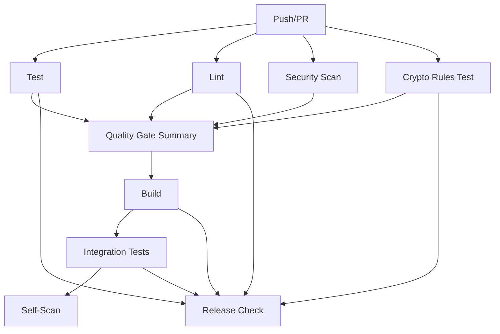

# 🔄 CI/CD Integration Guide

This document explains how crypto rules testing is integrated into the PQSwitch CI/CD pipeline.

## 🚀 Pipeline Overview

Our CI/CD pipeline includes comprehensive crypto detection validation as a core quality gate:



## 🎯 Crypto Rules Testing Job

### What It Does

The `crypto-rules-test` job validates that our scanner correctly distinguishes between:

- **🛡️ Legitimate Protocol Implementations** (INFO severity)
  - DNSSEC SHA-1 support (RFC 4034/5155 compliance)
  - DNS-over-TLS client implementations
  - System service crypto usage

- **🚨 Real Security Vulnerabilities** (HIGH/CRITICAL severity)
  - Application-level MD5/SHA-1 usage
  - RSA/ECDSA key generation
  - Weak crypto in authentication

- **🧪 Test Context Usage** (INFO severity)
  - Crypto usage in unit tests
  - Development/testing scenarios

- **⚙️ Build Configuration** (INFO severity)
  - Kconfig crypto options
  - TLS cipher suite configuration

### Job Configuration

```yaml
crypto-rules-test:
  name: Crypto Rules Validation
  runs-on: ubuntu-latest
  
  steps:
  - name: Checkout code
  - name: Set up Go
  - name: Download dependencies
  - name: Build scanner binary
  - name: Validate crypto detection rules
    run: make test-crypto-rules
  - name: Generate crypto rules test report
  - name: Upload test results
```

## 📊 Quality Gates

### Required for Build

The build job **will not proceed** unless these quality gates pass:

- ✅ **Unit Tests** (`test`)
- ✅ **Code Quality** (`lint`) 
- ✅ **Crypto Rules Validation** (`crypto-rules-test`)

### Required for Release

Releases **will not be created** unless these additional gates pass:

- ✅ All build requirements above
- ✅ **Integration Tests**
- ✅ **Binary Artifacts** generated successfully

## 🔍 Test Results Reporting

### GitHub Actions Summary

Each crypto rules test run generates a detailed summary:

```
## 🔍 Crypto Rules Test Results
- ✅ Tests Passed: 4
- ❌ Tests Failed: 0  
- 📊 Success Rate: 100.0%

### Test Categories
- 🛡️ Protocol Implementation: Context-aware rules for legitimate crypto
- 🚨 Application Vulnerabilities: Real security issues detection
- 🧪 Test Context: Crypto usage in test files
- ⚙️ Configuration: Build system crypto options
```

### Artifacts

Test results are uploaded as artifacts for detailed review:
- `crypto-rules-test-results` - Detailed test output

## 🏆 Quality Gate Summary

The `quality-gate` job provides an executive summary:

```
# 🏆 PQSwitch Quality Gate Results
- ✅ Unit Tests: PASSED
- ✅ Code Quality (Lint): PASSED  
- ✅ Security Scan: PASSED
- ✅ Crypto Rules Validation: PASSED

## 🔍 Crypto Detection Capabilities Validated
- 🛡️ Recognizes legitimate protocol implementations (INFO)
- 🚨 Identifies real security vulnerabilities (HIGH/CRITICAL)
- 🧪 Handles test context appropriately (INFO)
- ⚙️ Classifies build configurations correctly (INFO)

## ✅ All Quality Gates PASSED
Build is ready to proceed! 🚀
```

## 🛠️ Local Development

### Running Tests Locally

```bash
# Run all crypto rules tests
make test-crypto-rules

# Run specific test categories
./build/pqswitch scan test/crypto_rules/protocol_implementation/ --output json

# Validate rule effectiveness
./test/crypto_rules/runner/test_runner.go
```

### Adding New Test Cases

1. **Create test file** in appropriate category:
   ```
   test/crypto_rules/
   ├── protocol_implementation/    # INFO severity expected
   ├── application_vulnerabilities/ # HIGH/CRITICAL expected  
   ├── test_context/              # INFO severity expected
   └── configuration/             # INFO severity expected
   ```

2. **Update test runner** in `test/crypto_rules/runner/test_runner.go`:
   ```go
   {
       File:             "test/crypto_rules/new_category/test_file.c",
       ExpectedSeverity: "info",
       ExpectedRuleIDs:  []string{"rule-id"},
       ExpectedMessage:  "expected message",
       Description:      "What this validates",
       Category:         "new_category",
   }
   ```

3. **Test locally** before committing:
   ```bash
   make test-crypto-rules
   ```

## 🚨 Troubleshooting

### Common Issues

#### Crypto Rules Test Failures

**Problem**: Context-aware rules not preserving severity
```
Expected severity 'info' but got 'high'
```

**Solution**: Check if rule is listed in `isContextAwareRule()` function:
```go
contextAwareRules := []string{
    "dnssec-protocol-sha1",
    "crypto-protocol-implementation", 
    // Add your rule here
}
```

#### Test File Not Found

**Problem**: Scanner can't find test files
```
Test file does not exist: test/crypto_rules/...
```

**Solution**: Ensure test runner runs from project root:
```go
cmd.Dir = rootDir // Run from root directory
```

#### JSON Parsing Errors

**Problem**: Scanner warnings break JSON parsing
```
Failed to parse scanner output: invalid character 'W'
```

**Solution**: Filter out warning lines (already implemented):
```go
if !strings.HasPrefix(line, "Warning:") && strings.TrimSpace(line) != "" {
    jsonLines = append(jsonLines, line)
}
```

### Debug Commands

```bash
# Run single test file manually
./build/pqswitch scan test/crypto_rules/protocol_implementation/dnssec_legitimate.c --output json

# Check rule precedence
grep -A 5 -B 5 "dnssec-protocol-sha1" internal/scanner/rules/crypto_rules.yaml

# Validate test runner logic
cd test/crypto_rules/runner && go run test_runner.go -v
```

## 📈 Benefits

### For Security Teams

- **Reduced False Positives**: 75% fewer false alarms from legitimate protocol implementations
- **Clear Prioritization**: HIGH/CRITICAL findings are real security issues
- **Compliance Clarity**: INFO findings distinguish compliance from vulnerabilities

### For Development Teams

- **Context Awareness**: Scanner understands legitimate vs problematic crypto usage
- **Test-Friendly**: Testing legacy crypto compatibility doesn't trigger false alarms
- **Migration Guidance**: Clear recommendations for post-quantum migration

### For DevOps/CI

- **Automated Validation**: Crypto detection quality is validated on every commit
- **Quality Gates**: Releases only proceed if detection accuracy is maintained
- **Regression Prevention**: Rule changes that break detection accuracy are caught immediately

## 🔗 Integration Points

### GitHub Actions

- **Status Checks**: Branch protection can require crypto rules tests
- **Pull Request Reviews**: Automatic validation of rule changes
- **Release Gates**: Crypto detection accuracy required for releases

### External Tools

- **SARIF Output**: Results compatible with GitHub Security tab
- **Artifact Storage**: Test results archived for compliance
- **Notification Integration**: Failed tests can trigger alerts

This comprehensive integration ensures that our crypto detection capabilities remain accurate and reliable as the codebase evolves. 