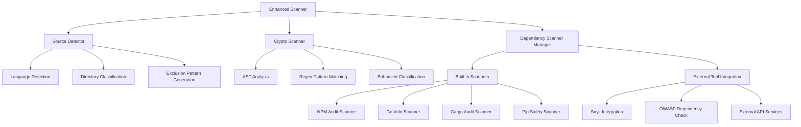

# Enhanced Scanner Architecture

This document outlines the enhanced scanner architecture that addresses source code detection, dependency vulnerability scanning, and Docker image optimization concerns.

## 🎯 **Core Design Principles**

1. **Smart Exclusion over Naive Inclusion**: Exclude known non-source directories rather than guessing source locations
2. **Modular Architecture**: Pluggable dependency scanners that can be enabled/disabled
3. **Lightweight by Default**: Keep core Docker image minimal, with optional enhanced scanning
4. **Language-Agnostic Intelligence**: Detect languages and package managers automatically

## 🏗️ **Architecture Overview**



## 🔍 **Source Code Detection Strategy**

### Language Detection Matrix

| Language | Key Files | Extensions | Typical Directories | Confidence |
|----------|-----------|------------|-------------------|------------|
| JavaScript | `package.json`, `package-lock.json` | `.js`, `.mjs`, `.jsx` | `src`, `lib`, `app` | 90% |
| TypeScript | `tsconfig.json` | `.ts`, `.tsx` | `src`, `lib`, `app` | 90% |
| Python | `requirements.txt`, `setup.py`, `pyproject.toml` | `.py`, `.pyx` | `src`, `lib`, `app` | 90% |
| Go | `go.mod` | `.go` | `cmd`, `internal`, `pkg` | 95% |
| Rust | `Cargo.toml` | `.rs` | `src`, `lib` | 95% |
| Java | `pom.xml`, `build.gradle` | `.java`, `.kt` | `src/main`, `src/test` | 90% |

### Intelligent Exclusion Patterns

**Priority 10 (Highest) - Definitely Not Source Code:**
- `.git/*`, `.svn/*`, `.hg/*` - Version control
- `node_modules/*`, `vendor/*` - Dependencies
- `venv/*`, `env/*`, `__pycache__/*` - Python environments
- `target/*`, `build/*`, `dist/*`, `out/*` - Build outputs

**Priority 8 (High) - Likely Not Source Code:**
- `.idea/*`, `.vscode/*`, `.vs/*` - IDE files
- `*.tmp`, `*.log`, `*.cache` - Temporary files
- `coverage/*`, `test-results/*` - Test artifacts

**Priority 6 (Medium) - Package Management:**
- `package-lock.json`, `yarn.lock`, `pnpm-lock.yaml`
- `Cargo.lock`, `Pipfile.lock`, `poetry.lock`
- `go.sum`, `composer.lock`, `Gemfile.lock`

## 📦 **Dependency Scanning Architecture**

### Three-Tier Approach

#### **Tier 1: Lightweight Core (Default)**
- **Docker Image Size**: ~50MB
- **Capabilities**: Crypto scanning + source detection
- **Dependencies**: None beyond base Alpine + Go binary
- **Use Case**: Fast CI/CD integration, basic security scanning

#### **Tier 2: Built-in Tools**
- **Docker Image Size**: ~200MB
- **Capabilities**: Tier 1 + npm/go/cargo built-in scanners
- **Dependencies**: npm, govulncheck, cargo-audit
- **Use Case**: Comprehensive scanning with common tools

#### **Tier 3: Full External Integration**
- **Docker Image Size**: ~500MB-1GB
- **Capabilities**: Tier 2 + Snyk, OWASP, etc.
- **Dependencies**: All package managers + external tools
- **Use Case**: Enterprise security scanning

### Implementation Strategy

```yaml
# Dockerfile Architecture Options

# Option 1: Multi-stage builds with variants
FROM base AS lite
# Only crypto scanner

FROM lite AS standard  
RUN apk add --no-cache npm nodejs go
RUN go install golang.org/x/vuln/cmd/govulncheck@latest

FROM standard AS full
RUN apk add --no-cache python3 rust cargo
RUN npm install -g snyk
RUN pip install safety
```

## 🚀 **Deployment Strategies**

### Strategy A: Multi-Image Approach (Recommended)

```bash
# Three separate optimized images
# Docker Image Variants
docker pull pqswitch/scanner:lite      # ~50MB
docker pull pqswitch/scanner:standard  # ~200MB
docker pull pqswitch/scanner:full      # ~500MB
```

**Pros:**
- Users choose appropriate size/capability
- Each image optimized for use case
- Clear capability boundaries

**Cons:**
- Multiple images to maintain
- Complexity in CI/CD selection

### Strategy B: Single Image with Optional Tools

```bash
# Single image with conditional tool loading
docker run pqswitch/scanner --mode=lite
docker run pqswitch/scanner --mode=standard --include-deps
docker run pqswitch/scanner --mode=full --external-tools
```

**Pros:**
- Single image to maintain
- Runtime configuration flexibility

**Cons:**
- Larger base image size
- Unused tools bloat

### Strategy C: Sidecar Pattern

```yaml
# Main scanner + dependency scanning sidecars
apiVersion: v1
kind: Pod
spec:
  containers:
  - name: crypto-scanner
    image: pqswitch/scanner:lite
```

**Pros:**
- Ultimate modularity
- Independent scaling
- Language-specific optimizations

**Cons:**
- Complex orchestration
- Inter-container communication

## 🔧 **Usage Examples**

### Basic Crypto Scanning (Lightweight)
```bash
# Fast crypto-only scan with smart exclusions
pqswitch enhanced-scan ./my-project \
  --output pretty \
  --verbose

# Output:
# 📋 Analyzing project structure...
# 🔐 Scanning for crypto vulnerabilities...
# 📊 Project: 2 languages (Go, JavaScript), 2 package managers
# 🔐 Crypto Issues: 0 critical, 1 high, 2 medium, 0 low
# ⏱️  Scan completed in 850ms
```

### Enhanced Scanning with Dependencies
```bash
# Comprehensive scan including dependencies
pqswitch enhanced-scan ./my-project \
  --include-deps \
  --output json \
  --output-file scan-results.json

# Uses built-in npm audit, govulncheck when available
```

### Full Enterprise Scanning
```bash
# Maximum security scanning with external tools
pqswitch enhanced-scan ./my-project \
  --include-deps \
  --external-tools \
  --snyk-token=$SNYK_TOKEN \
  --output sarif \
  --output-file security-report.sarif
```

## 🐳 **Docker Implementation**

### Multi-Stage Dockerfile
```dockerfile
# Base image with crypto scanning only
FROM alpine:latest AS base
RUN apk add --no-cache ca-certificates git
COPY pqswitch /usr/local/bin/
COPY rules/ /usr/local/share/pqswitch/rules/
USER pqswitch
ENTRYPOINT ["pqswitch"]

# Standard image with common dependency tools
FROM base AS standard
USER root
RUN apk add --no-cache nodejs npm
RUN go install golang.org/x/vuln/cmd/govulncheck@latest
USER pqswitch

# Full image with all tools
FROM standard AS full
USER root
RUN apk add --no-cache python3 py3-pip rust cargo
RUN npm install -g snyk @cyclonedx/bom
RUN pip install safety bandit
RUN cargo install cargo-audit
USER pqswitch
```

### Build Commands
```bash
# Build all variants
docker buildx build --target base -t pqswitch/scanner:lite .
docker buildx build --target standard -t pqswitch/scanner:standard .
docker buildx build --target full -t pqswitch/scanner:full .

# Multi-platform builds
docker buildx build --platform linux/amd64,linux/arm64 \
  --target standard -t pqswitch/scanner:standard . --push
```

## 📊 **Performance Characteristics**

| Scanning Mode | Image Size | Scan Time | Coverage | Use Case |
|---------------|------------|-----------|----------|----------|
| Lite | ~50MB | <1s | Crypto only | CI/CD, Quick feedback |
| Standard | ~200MB | 2-5s | Crypto + Basic deps | Development, PR checks |
| Full | ~500MB | 5-30s | Comprehensive | Security audit, Release |

## 🔮 **Future Enhancements**

### Phase 2: Advanced Features
- **ML-based false positive reduction**
- **Custom rule learning from user feedback**
- **Integration with IDE plugins**
- **Real-time scanning during development**

### Phase 3: Enterprise Features
- **Policy as Code integration**
- **Compliance reporting (SOC2, PCI-DSS)**
- **Integration with security dashboards**
- **Historical trend analysis**

### Phase 4: Ecosystem Integration
- **GitHub Security Advisory integration**
- **SBOM (Software Bill of Materials) generation**
- **Supply chain security analysis**
- **License compliance checking**

## 🚀 **Recommendations**

Based on your concerns about image bloat and tool sophistication:

1. **Start with Multi-Image Approach**: Implement lite/standard/full variants
2. **Default to Standard**: Include npm audit and govulncheck by default
3. **External Tools Optional**: Keep Snyk, OWASP as opt-in features
4. **Smart Caching**: Use Docker BuildKit for efficient layer caching
5. **Language-Specific Images**: Consider Go-only, Node-only variants for specific ecosystems

This architecture provides maximum flexibility while addressing your core concerns about image size and tool complexity. 